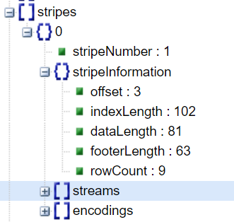

## ORC概述

Hive从0.11版本开始提供了ORC的文件格式，ORC文件不仅仅是一种列式文件存储格式，最重要的是有着很高的压缩比，并且对于MapReduce来说是可切分（Split）的。因此，在Hive中使用ORC作为表的文件存储格式，不仅可以很大程度的节省HDFS存储资源，而且对数据的查询和处理性能有着非常大的提升，因为ORC较其他文件格式压缩比高，查询任务的输入数据量减少，使用的Task也就减少了。

需要注意的是，ORC能很大程序的节省存储和计算资源，但它在读写时候需要消耗额外的CPU资源来压缩和解压缩，当然这部分的CPU消耗是非常少的。

对性能提升的另一个方面是通过在ORC文件中为每一个字段建立一个轻量级的索引，来判定一个文件中是否满足WHERE子句中的过滤条件。比如：当执行HQL语句：

```sql
SELECT COUNT(1) FROM orc_tb WHERE id = 0
```

先从ORC文件的metadata中读取索引信息，快速定位到id=0所在的offsets，如果从索引信息中没有发现id=0的信息，则直接跳过该文件。

## ORC结构


文件组成：

* Postscripts中存储该表的行数，压缩参数，压缩大小，列等信息；
* Stripe Footer中包含该stripe的统计结果，包括Max，Min，count等信息；
* FileFooter中包含该表的统计结果，以及各个Stripe的位置信息；
* IndexData中保存了该stripe上数据的位置信息，总行数等信息；
* RowData以stream的形式保存了数据的具体信息

数据的读取流程：


Hive读取数据的时候，根据FileFooter读出Stripe的信息，根据IndexData读出数据的偏移量从而读取出数据。
 ORC文件不仅仅是一种列式文件存储格式，最重要的是有着**很高的压缩比**，并且对于MapReduce来说是**可切分（Split）**的。因此，在Hive中使用ORC作为表的文件存储格式，不仅可以很大程度的节省HDFS存储资源，而且对数据的查询和处理性能有着非常大的提升，因为ORC较其他文件格式压缩比高，查询任务的输入数据量减少，使用的Task也就减少了。

## ORC文件信息

```sql
-- 1.创建orc表
CREATE TABLE orc_tb (
    id int,
    start_time string,
    lowcarbon  int 
) stored AS ORC;
-- 2.数据
1001    2021-12-12  123
1002    2021-12-12  45
1001    2021-12-13  43
1001    2021-12-13  45
1001    2021-12-13  23
1002    2021-12-14  45
1001    2021-12-14  230
1002    2021-12-15  45
1001    2021-12-15  23
```

我们通过查看ORC表对应的HDFS文件为：


hive提供了一个--orcfiledump参数用于查看HDFS上ORC表格的文件信息，在hive-0.13版本中的使用方法为：hive --orcfiledump <location-of-orc-file>，其他版本的使用方法可以去官方文档中查找。

可以通过如下命令，查看orc文件的数据：

```shell
hive --orcfiledump /user/hive/warehouse/study.db/orc_tb/000000_0
```

文件内容如下所示：

```json
{
  "fileName": "\/user\/hive\/warehouse\/study.db\/orc_tb\/000000_0",
  "fileVersion": "0.12",
  "writerVersion": "ORC_517",
  "numberOfRows": 9,
  "compression": "ZLIB",
  "compressionBufferSize": 262144,
  "schemaString": "struct<id:int,start_time:string,lowcarbon:int>",
  "schema": [
    {
      "columnId": 0,
      "columnType": "STRUCT",
      "childColumnNames": [
        "id",
        "start_time",
        "lowcarbon"
      ],
      "childColumnIds": [
        1,
        2,
        3
      ]
    },
    {
      "columnId": 1,
      "columnType": "INT"
    },
    {
      "columnId": 2,
      "columnType": "STRING"
    },
    {
      "columnId": 3,
      "columnType": "INT"
    }
  ],
  "stripeStatistics": [{
    "stripeNumber": 1,
    "columnStatistics": [
      {
        "columnId": 0,
        "count": 9,
        "hasNull": false
      },
      {
        "columnId": 1,
        "count": 9,
        "hasNull": false,
        "bytesOnDisk": 22,
        "min": 1001,
        "max": 1002,
        "sum": 9012,
        "type": "LONG"
      },
      {
        "columnId": 2,
        "count": 9,
        "hasNull": false,
        "bytesOnDisk": 38,
        "min": "2021-12-12",
        "max": "2021-12-15",
        "totalLength": 90,
        "type": "STRING"
      },
      {
        "columnId": 3,
        "count": 9,
        "hasNull": false,
        "bytesOnDisk": 21,
        "min": 23,
        "max": 230,
        "sum": 622,
        "type": "LONG"
      }
    ]
  }],
  "fileStatistics": [
    {
      "columnId": 0,
      "count": 9,
      "hasNull": false
    },
    {
      "columnId": 1,
      "count": 9,
      "hasNull": false,
      "bytesOnDisk": 22,
      "min": 1001,
      "max": 1002,
      "sum": 9012,
      "type": "LONG"
    },
    {
      "columnId": 2,
      "count": 9,
      "hasNull": false,
      "bytesOnDisk": 38,
      "min": "2021-12-12",
      "max": "2021-12-15",
      "totalLength": 90,
      "type": "STRING"
    },
    {
      "columnId": 3,
      "count": 9,
      "hasNull": false,
      "bytesOnDisk": 21,
      "min": 23,
      "max": 230,
      "sum": 622,
      "type": "LONG"
    }
  ],
  "stripes": [{
    "stripeNumber": 1,
    "stripeInformation": {
      "offset": 3,
      "indexLength": 102,
      "dataLength": 81,
      "footerLength": 63,
      "rowCount": 9
    },
    "streams": [
      {
        "columnId": 0,
        "section": "ROW_INDEX",
        "startOffset": 3,
        "length": 11
      },
      {
        "columnId": 1,
        "section": "ROW_INDEX",
        "startOffset": 14,
        "length": 28
      },
      {
        "columnId": 2,
        "section": "ROW_INDEX",
        "startOffset": 42,
        "length": 37
      },
      {
        "columnId": 3,
        "section": "ROW_INDEX",
        "startOffset": 79,
        "length": 26
      },
      {
        "columnId": 1,
        "section": "DATA",
        "startOffset": 105,
        "length": 22
      },
      {
        "columnId": 2,
        "section": "DATA",
        "startOffset": 127,
        "length": 11
      },
      {
        "columnId": 2,
        "section": "LENGTH",
        "startOffset": 138,
        "length": 5
      },
      {
        "columnId": 2,
        "section": "DICTIONARY_DATA",
        "startOffset": 143,
        "length": 22
      },
      {
        "columnId": 3,
        "section": "DATA",
        "startOffset": 165,
        "length": 21
      }
    ],
    "encodings": [
      {
        "columnId": 0,
        "kind": "DIRECT"
      },
      {
        "columnId": 1,
        "kind": "DIRECT_V2"
      },
      {
        "columnId": 2,
        "kind": "DICTIONARY_V2",
        "dictionarySize": 4
      },
      {
        "columnId": 3,
        "kind": "DIRECT_V2"
      }
    ]
  }],
  "fileLength": 490,
  "paddingLength": 0,
  "paddingRatio": 0,
  "status": "OK"
}
```

通过json格式化工具查看json视图格式：


接下来，我们就对内容进行逐个拆解。

### schema


在orc_tb中，我们定义了三个字段，分别是id、start_time和lowcarbon。

* 编号为0的columnId中描述了整个表的字段定义，在childColumnNames中就是表中的字段定义；
* 表中的字段从1开始进行编号。


### stripeStatistics

stripeStatistics：ORC文件中所有stripes的统计信息，其中有每个stripe中每个字段的min/max值，是否有空值等等。


### fileStatistics

fileStatistics是整个文件中`每个字段的统计信息`，该表只有一个文件，所以也只有一个stripe。


### stripes

stripes中列出了所有stripes的元数据信息，包括index data, row data和stripe footer。




## ORC查询优化原理

经过上面ORC文件的元数据了解了一个ORC文件会被分成多个stripe，而且文件的元数据中有每个字段的统计信息（min/max,hasNull等等），这就为ORC的查询优化做好了基础准备。

假如我的查询过滤条件为WHERE id = 0;在Map Task读到一个ORC文件时，首先从文件的统计信息（fileStatistics）中看看id字段的min/max值，如果0不包含在内，那么这个文件就可以直接跳过了。

基于这点，还有一个更有效的优化手段是在数据入库的时候，根据id字段排序后入库，这样尽量能使id=0的数据位于同一个文件甚至是同一个stripe中，那么在查询时候，只有负责读取该文件的Map Task需要扫描文件，其他的Map Task都会跳过扫描，大大节省Map Task的执行时间。海量数据下，使用ORDER BY可能不太现实，另一个有效手段是使用DISTRIBUTE BY id SORT BY id;

参数开启：

```shell
# 是否自动使用索引
set hive.optimize.index.filter = true;
```

默认为false（不使用）；如果不设置该参数为true，那么ORC的索引当然也不会使用。

总的来说，Hive中的ORC不仅仅有着高压缩比，很大程序的节省存储空间和计算资源，而且在其上还做了许多优化（这里仅仅介绍了row_index）。如果使用Hive作为大数据仓库，强烈建议主要使用ORC文件格式作为表的存储格式。

参考链接：

[1.更高的压缩比，更好的性能–使用ORC文件格式优化Hive](http://lxw1234.com/archives/2016/04/630.htm)

[2.Hive ORC](https://www.jianshu.com/p/36e4f0137744)


