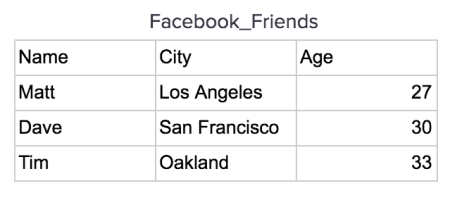
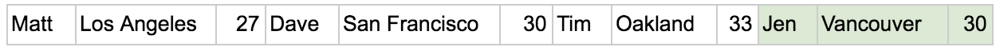
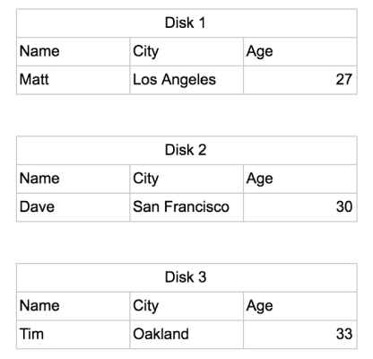
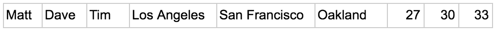
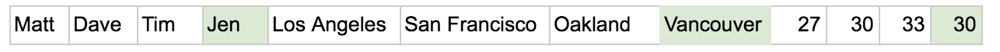
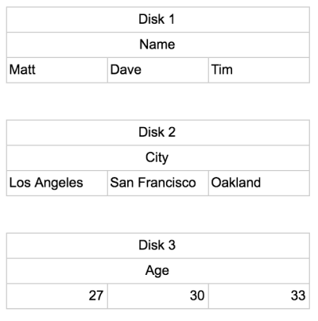

行式存储VS.列式存储

行式存储：传统的关系型数据库，如 Oracle、DB2、MySQL、SQL SERVER 等采用行式存储法(Row-based)，在基于行式存储的数据库中， 数据是按照行数据为基础逻辑存储单元进行存储的， 一行中的数据在存储介质中以连续存储形式存在。

我们以facebook好友数据来对比说明行式存储和列式存储：

行存储将会以下列方式将数据存储在磁盘上，这种方式利于数据一行一行的写入，写入一条数据记录时，只需要将数据追加到已有数据记录后面即可。

行模式存储适合 OLTP(Online Transaction Processing)系统。因为数据基于行存储，所以数据的写入会更快。对按记录查询数据也更简单。

那么，行式存储在什么情况下不能很好的处理呢？

例如，我们想要统计所有用户的年龄之和，那么我们需要将所有行数据的所有列数据都加载到内存中，然后对 age列做 sum 操作，从而得到结果。这种方式存在两个方面的缺陷：

1. 浪费计算时间；
2. 多次磁盘扫描。

我们假设磁盘一次能够存储3列的数据。那么，在行式存储中，fackbook用户好友表则按照下图的方式在磁盘上进行数据存储：

那么，如果我们想要计算所有用户的年龄之和，我们需要扫描3个磁盘的数据，然后遍历全部的字段（本例中是3个字段），才能够完成数据查询需求。

所以，对于行式存储来说，写数据性能很好。但是，从中读取数据就需要额外的内存空间以及磁盘扫描。

而对于这种经常需要通过大量数据集来聚合统计数据的需求其实是 OLAP 系统的常见行为。基于这个需求我们也可以明白为什么这几年列式存储开始流行。因为数据，大数据，数据分析，也就是 OLAP(Online Analytical Processing)在线分析系统的需求增多了，数据写入的事务和按记录查询数据都不是它的关注点，它关注的是数据过滤，统计。

列式存储：列式存储(Column-based)是相对于行式存储来说的，新兴的 Hbase、HP Vertica、EMC Greenplum 等分布式数据库均采用列式存储。在基于列式存储的数据库中， 数据是按照列为基础逻辑存储单元进行存储的，一列中的数据在存储介质中以连续存储形式存在。

同样的，我们还是以行式存储中的fackbook用户表为例，进行讲解。

列式存储数据组织方式：

列式存储将每一列的数据组织在一起，有利于对于列的操作，如上面我们说到的统计所有年龄之和。

依然假设磁盘一次可以读取 3 个方框的数据(实际按 byte 读取)。可以看出按列存储组织数据的方式，只需要 1 次磁盘操作就可以完成。

任何的选择和倾向都是有代价的，在计算机的世界中，空间换时间，时间换空间，一致性可用性相互平衡等。选择列式存储必然也有不利的一面。首先就表现在数据写入上，下图是列式存储数据写入流程：

当一条新数据到来，需要将每一列存储到对应的位置。这样就需要多次写磁盘操作。如果数据是存储在单一的磁盘上，那么将会和行式存储处理分析问题一样，需要将所有的数据加载到内存中进行处理。

但是，当列式存储的数据存储在不同的磁盘上时，会有明显的性能提升。例如，以下图所示的形式存储数据：

那么，对于列式存储来说，如果我们想要计算所有用户的年龄之和，则只需要读取一块磁盘（disk3）就可以了。这样就大大减少了磁盘访问的次数以及额外的内存空间，从而提升数据计算的速度。

列式存储的优势：

1. 自动索引：因为基于列存储，所以每一列本身就相当于索引。所以在做一些需要索引的操作时，就不需要额外的数据结构来为此列创建合适的索引。

2. 利于数据压缩：利于压缩有两个原因。一来你会发现大部分列数据基数其实是重复的，拿上面的数据来说，因为同一个 author 会发表多篇博客，所以 author 列出现的所有值的基数肯定是小于博客数量的，因此在 author 列的存储上其实是不需要存储博客数量这么大的数据量的；二来相同的列数据类型一致，这样利于数据结构填充的优化和压缩，而且对于数字列这种数据类型可以采取更多有利的算法去压缩存储。

参考链接：

[“行式存储”和“列式存储”的区别](https://www.jianshu.com/p/3d3950c9fb06)

[Row vs Column Oriented Databases](https://dataschool.com/data-modeling-101/row-vs-column-oriented-databases/)

